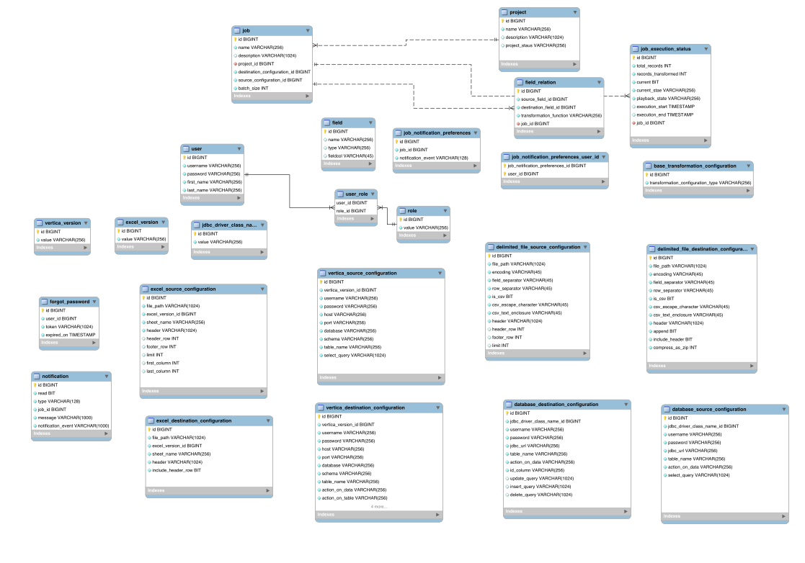

## Project Description

The HP Data Quality team is tasked with moving large amounts of data on a regular basis.  They would like to development an Extract Transform and Load tool that allows them to move file and relational data on a regular basis and create a monitoring service which can display the status of the currently scheduled and recently completed jobs.  Often they are moving data between regular and HDFS file systems.

###[Winning Wireframes](webDesign/wireframeIframe.md)
###[Winning Storyboards](webDesign/storyboardIframe.md)

###   Repos
 * [Project Documentaiton (this repo)](https://github.com/topcoderinc/HP-Data-Quality-ETL-project)
 * [Wireframes ](https://github.com/topcoderinc/HP-Data-Quality-ETL-wireframes)
 * [Storyboards ](https://github.com/topcoderinc/HP-Data-Quality-ETL-storyboards)

## Challenge Index
| Type | title | direct |
|-----|-------|---------|
|Wireframe| [HP DATA QUALITY ETL APPLICATION WIREFRAME CHALLENGE ](https://www.topcoder.com/challenge-details/30055286/?type=design&noncache=true) | [direct link ](https://www.topcoder.com/direct/contest/detail.action?projectId=30055286)|
|Web Design| [HP DATA QUALITY ETL APPLICATION DESIGN CHALLENGE](https://www.topcoder.com/challenge-details/30055649/?type=design&noncache=true) | [direct link](https://www.topcoder.com/direct/contest/detail.action?projectId=30055649)
|Architecture|[HP DATA QUALITY ETL APP ARCHITECTURE CHALLENGE](https://www.topcoder.com/challenge-details/30056613/?type=develop&noncache=true)| [direct link](https://www.topcoder.com/direct/contest/detail.action?projectId=30056613)
|Prototype|[HP DATA QUALITY ETL APP UI PROTOTYPE CHALLENGE](https://www.topcoder.com/challenge-details/30056711/?type=develop&noncache=true)|[direct link](https://www.topcoder.com/direct/contest/detail.action?projectId=30056711)

---

## [Model ERD](/architecture/ERD.svg)

---
